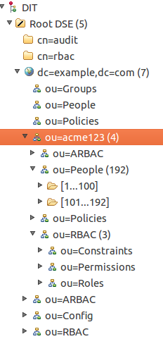

   Licensed to the Apache Software Foundation (ASF) under one
   or more contributor license agreements.  See the NOTICE file
   distributed with this work for additional information
   regarding copyright ownership.  The ASF licenses this file
   to you under the Apache License, Version 2.0 (the
   "License"); you may not use this file except in compliance
   with the License.  You may obtain a copy of the License at

     http://www.apache.org/licenses/LICENSE-2.0

   Unless required by applicable law or agreed to in writing,
   software distributed under the License is distributed on an
   "AS IS" BASIS, WITHOUT WARRANTIES OR CONDITIONS OF ANY
   KIND, either express or implied.  See the License for the
   specific language governing permissions and limitations
   under the License.

-------------------------------------------------------------------------------
# README for Apache Fortress Multitenancy Configuration

This document describes Apache Fortress multitenacy.

-------------------------------------------------------------------------------
## Table of Contents

 * SECTION 1. Multitenancy Overview.
 * SECTION 2. About the Datastructures.
 * SECTION 3. How the APIs work.
 * SECTION 4. How to Setup a New Tenant.
 * SECTION 5. Unit Testing.
 * SECTION 6. Other Tools.

-------------------------------------------------------------------------------
## SECTION 1.  Multitenancy Overview

From Wikipedia:
* *Software Multitenancy refers to a software architecture in which a single instance of a software runs on a server and serves multiple tenants. A tenant is a group of users who share a common access with specific privileges to the software instance. With a multitenant architecture, a software application is designed to provide every tenant a dedicated share of the instance including its data, configuration, user management, tenant individual functionality and non-functional properties. Multitenancy contrasts with multi-instance architectures, where separate software instances operate on behalf of different tenants.*

 *Commentators regard multitenancy as an important feature of cloud computing.*

 https://en.wikipedia.org/wiki/Multitenancy

More here:
 * http://symas.com/products/enforcement-foundry/multi-tenancy/

-------------------------------------------------------------------------------
## SECTION 2.  About the Datastructures

1. Each tenant gets its own copy of the data.  For example if a tenant's id is acme123, there will be a container underneath the suffix:

 ```
 ou=acme123, dc=example, dc=com.
 ```

2. Beneath the acme123 *container* node will be that tenant's copy of data.  For example:

 ```
 ou=People,  ou=acme123, dc=example, dc=com
 ou=Roles,   ou=acme123, dc=example, dc=com
 ou=Perms,   ou=acme123, dc=example, dc=com
 ou=Groups,  ou=acme123, dc=example, dc=com
 ...
 ```

3. Screenshot with Apache Directory Studio.

 

-------------------------------------------------------------------------------
## SECTION 3.  How the APIs work

The tenant id is passed during object instantiation.

 ```
 AdminMgr adminMgr = AdminMgrFactory.createInstance( "acme123" );
 ```

 The lifecycle of that particular object will be on behalf of that tenant id.

-------------------------------------------------------------------------------
## SECTION 4.  How to Setup a New Tenant

1. Use the Fortress load utility to set up new tenant contexts.  The *addcontainer* tag can be used to do this:

 ```
 ...
 <addcontainer>
     <container name="acme123" description="ACME 123 tenant context"/>
 </addcontainer>
 ...
 ```

2. Or, simply use ldif format to create the new tenant containers.  Import with any LDAP client:
 ```
 dn: ou=acme123, dc=example,dc=com
 ou: acme123
 objectClass: organizationalUnit
 description: ACME 123 tenant context
 ```

3. After the new container has been added, you may use again the fortress ant load utility to initialize the new tenant Directory Information Tree (DIT).  For example:

 ```
 ...
 <addcontainer>
     <container name="People" description="Fortress People"/>
     <container name="Policies" description="Fortress Policies"/>
     <container name="RBAC" description="Fortress RBAC Policies"/>
     <container name="Roles" parent="RBAC" description="Fortress Roles"/>
     <container name="Permissions" parent="RBAC" description="Fortress Permissions"/>
     <container name="Constraints" parent="RBAC" description="Fortress Separation of Duty Constraints"/>
     <container name="ARBAC" description="Fortress Administrative RBAC Policies"/>
     <container name="OS-U" parent="ARBAC" description="Fortress User Organizational Units"/>
     <container name="OS-P" parent="ARBAC" description="Fortress Perm Organizational Units"/>
     <container name="AdminRoles" parent="ARBAC" description="Fortress AdminRoles"/>
     <container name="AdminPerms" parent="ARBAC" description="Fortress Admin Permissions"/>
 </addcontainer>
 ...
 ```

4. When running the fortress ant load, pass the tenant id as a -D parameter on the command line:
 ```
 mvn install -Dload.file=./ldap/setup/MyLoadFile.xml -Dtenant=acme123
 ```

 Passing the tenant system property scopes all subsequent load operations to that particular tenant's container inside the DIT.

___________________________________________________________________________________
## SECTION 5.  Unit Testing

Pass the tenant id as system property when running the tests:

 ```
 mvn test -Dtest=FortressJUnitTest -Dtenant=acme123
 ```

 Passing tenant system properties scopes all subsequent test operations to that particular tenant.

___________________________________________________________________________________
## SECTION 6.  Other Tools

Other tools like Fortress console and CLI may be run pointing to a tenant's data.

1. Fortress Console:

 ```
 mvn -Pconsole test -Dtenant=acme123
 ```

2. Fortress CLI:

 ```
 mvn -Pcli test -Dtenant=acme123
 ```

___________________________________________________________________________________
#### END OF README-MULTITENANCY