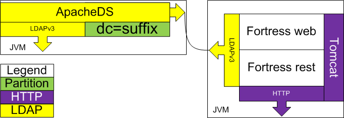

   Licensed to the Apache Software Foundation (ASF) under one
   or more contributor license agreements.  See the NOTICE file
   distributed with this work for additional information
   regarding copyright ownership.  The ASF licenses this file
   to you under the Apache License, Version 2.0 (the
   "License"); you may not use this file except in compliance
   with the License.  You may obtain a copy of the License at

     https://www.apache.org/licenses/LICENSE-2.0

   Unless required by applicable law or agreed to in writing,
   software distributed under the License is distributed on an
   "AS IS" BASIS, WITHOUT WARRANTIES OR CONDITIONS OF ANY
   KIND, either express or implied.  See the License for the
   specific language governing permissions and limitations
   under the License.

# ApacheDS & Fortress QUICKSTART

 Apache Fortress 3.0.1 and ApacheDS Quickstart System Architecture
 

-------------------------------------------------------------------------------
## Table of Contents

 * Document Overview
 * SECTION 1. Prerequisites
 * SECTION 2. ApacheDS Installation
 * SECTION 3. Apache Fortress Core Setup
 * SECTION 4. Apache Fortress Core Integration Test
 * SECTION 5. Apache Tomcat Setup
 * SECTION 6. Apache Fortress Rest Setup
 * SECTION 7. Apache Fortress Web Setup

___________________________________________________________________________________
## Document Overview

 * This document contains instructions to install Apache Fortress 3.0.1 Core, Web, Rest and ApacheDS.

-------------------------------------------------------------------------------
## SECTION 1. Prerequisites

Minimum software requirements:
 * RHEL or Debian Machine
 * Java SDK >= 11
 * Apache Maven >= 3.6.3
___________________________________________________________________________________
## SECTION 2. ApacheDS Installation

1. Download and install Apache Directory Server

 a. [Download either the 32 or 64-bit linux binary](https://directory.apache.org/apacheds/download/download-linux-bin.html)

 b. For 32-bit (as sudo or root):

```bash
chmod a+x *.bin
./apacheds-[version]-32bit.bin
```

 b. For 64-bit (as sudo or root):

```bash
chmod a+x *.bin
./apacheds-[version]-64bit.bin
```

 *Accept the defaults.*

2. Edit ApacheDS conf file

```bash
vi /opt/apacheds-[version]/conf/wrapper.conf
```

3. Add location of java:

```
wrapper.java.command=/usr/bin/java
```

 *contains fully qualified location of target machine's java.*

5. Save and exit.

6. After installation start the directory server process. From system command prompt (as sudo or root):

```bash
/etc/init.d/apacheds-[version]-default start
```
7. Check the status of server process. From system command prompt (as sudo or root):

```
/etc/init.d/apacheds-[version]-default status
ApacheDS - default is running (70041).
```

___________________________________________________________________________________
## SECTION 3. Apache Fortress Core Setup

1. Download the package:
 a. from git:
```bash
git clone --branch [version] https://gitbox.apache.org/repos/asf/directory-fortress-core.git
cd directory-fortress-core
```

 b. or download package:
```bash
wget https://www.apache.org/dist/directory/fortress/dist/[version]/fortress-core-[version]-source-release.zip
unzip fortress-core-[version]-source-release.zip
cd fortress-core-[version]
```

2. Prepare the package:

```bash
cp build.properties.example build.properties
```

 *[build.properties.example](build.properties.example) contains the apacheds default config. Learn more about the config here: [README-CONFIG](README-CONFIG.md)*

3. Prepare your terminal for execution of maven commands.

```bash
export JAVA_HOME=...
export M2_HOME=...
export PATH=$PATH:$M2_HOME/bin
```

4. Build fortress core. This step will generate config artifacts using settings from build.properties.

```bash
mvn clean install
```

5. Import Fortress ldap schema into ApacheDS server.

 *There are many ways to import an ldif file into an LDAP server like ApacheDS.  For example an LDAP browser like Apache Directory Studio can be used.  This guide shows how to use the OpenLDAP client.*

 a. Test to see if it is already installed.  From the command prompt enter:

```bash
ldapmodify
```

 b. If the command was not found we need to install the OpenLDAP client:

  i. For Redhat based systems:

```bash
yum install -y openldap-clients
```

  ii. Else for Debian based systems:

```bash
apt-get install ldap-utils
```

6. Load the Apache Fortress schema into ApacheDS server.

 Load the [fortress schema](ldap/schema/apacheds-fortress.ldif) to ApacheDS instance using ldapmodify command.

```bash
ldapmodify -h localhost -p 10389 -D uid=admin,ou=system -w secret -a -f ./ldap/schema/apacheds-fortress.ldif
```

___________________________________________________________________________________
## SECTION 4. Apache Fortress Core Integration Test

1. Perform a base load of data.

 From fortress core base folder, enter the following command:

```bash
mvn install -Dload.file=./ldap/setup/refreshLDAPData.xml
```

 *These will build the Directory Information Tree (DIT), create the config and data policies needed for the integration test to follow.*

2. Now run junit integration test.

 Enter the following command:

```bash
mvn -Dtest=FortressJUnitTest test
```

 *Tests the APIs against your LDAP server.*

3. Verify the tests worked:

```bash
Tests run: Failures: 0, Errors: 0, Skipped: 0, Time elapsed: 372.708 sec - in org.apache.directory.fortress.core.impl.FortressJUnitTest
Results:
Tests run: Failures: 0, Errors: 0, Skipped: 0
[INFO]
[INFO] --- maven-antrun-plugin:1.8:run (default) @ fortress-core ---
[INFO] Executing tasks
fortress-load:
[INFO] Executed tasks
[INFO] ------------------------------------------------------------------------
[INFO] BUILD SUCCESS
[INFO] ------------------------------------------------------------------------
```

4. Rerun the tests to verify teardown APIs work:

```bash
mvn -Dtest=FortressJUnitTest test
```

5. Verify that worked also:

```bash
Tests Failures: 0, Errors: 0, Skipped: 0, Time elapsed: 778.501 sec - in org.apache.directory.fortress.core.impl.FortressJUnitTest
Results :
Tests run: Failures: 0, Errors: 0, Skipped: 0
[INFO]
[INFO] --- maven-antrun-plugin:1.8:run (default) @ fortress-core ---
[INFO] Executing tasks
fortress-load:
[INFO] Executed tasks
[INFO] ------------------------------------------------------------------------
[INFO] BUILD SUCCESS
[INFO] ------------------------------------------------------------------------
```
 Notice more tests ran this time vs the first time, due to teardown.

 Test Notes:
  * If tests complete without errors Fortress works with your Apache Directory server.
  * These tests load thousands of objects into the target ldap server.
  * Warning messages are negative tests in action.

6. Optional sections in the [README](README.md) file:

 * SECTION 11. Instructions to run the Apache Fortress Command Line Interpreter (CLI).
 * SECTION 12. Instructions to run the Apache Fortress Command Console.
 * SECTION 13. Instructions to build and test the Apache Fortress samples.
 * SECTION 14. Instructions to performance test.

___________________________________________________________________________________
## SECTION 4. Apache Tomcat Setup

During this section, you will be asked to setup Apache Tomcat 10 and prepare for usage with Apache Fortress

1. Download and prepare the package:

```bash
# Requires >= Tomcat 10:
wget https://archive.apache.org/dist/tomcat/tomcat-10/v[version]/bin/apache-tomcat-[version].tar.gz
tar -xvf apache-tomcat-[version].tar.gz
mv apache-tomcat-[version] /usr/local/tomcat10
```
*Change the tomcat version as neeeded.*
*For BSD variants (i.e. Mac) append /* to the folder name above on mv command.*

2. Download the fortress realm proxy jar into tomcat/lib folder:

```bash
wget https://repo.maven.apache.org/maven2/org/apache/directory/fortress/fortress-realm-proxy/[version]/fortress-realm-proxy-[version].jar -P /usr/local/tomcat10/lib
```

3. Prepare tomcat fortress deployments (optional):

```bash
vi /usr/local/tomcat10/conf/tomcat-users.xml
```

4. Add tomcat user to deploy fortress (optional):

```xml
<role rolename="manager-script"/>
<role rolename="manager-gui"/>
<user username="tcmanager" password="m@nager123" roles="manager-script"/>
<user username="tcmanagergui" password="m@nager123" roles="manager-gui"/>
```

5. Save and exit tomcat-users.xml file

6. Configure Tomcat as a service (optional)

a. Edit the config file:

```bash
vi /etc/init.d/tomcat
```

b. Add the following:

```
#!/bin/bash
# description: Tomcat Start Stop Restart
# processname: tomcat
# chkconfig: 234 20 80
CATALINA_HOME=/usr/local/tomcat10
case $1 in
start)
sh $CATALINA_HOME/bin/startup.sh
;;
stop)
sh $CATALINA_HOME/bin/shutdown.sh
;;
restart)
sh $CATALINA_HOME/bin/shutdown.sh
sh $CATALINA_HOME/bin/startup.sh
;;
esac
exit 0
```

c. Add the init script to startup for run level 2, 3 and 4:

```bash
cd /etc/init.d
chmod 755 tomcat
chkconfig --add tomcat
chkconfig --level 234 tomcat on
```

7. Start tomcat server:

a. If running Tomcat as a service:

```bash
service tomcat start
```

b. Else

```
/usr/local/tomcat10/bin/startup.sh
```

8.  Verify clean logs after startup:

```bash
tail -f -n10000 /usr/local/tomcat10/logs/catalina.out
```

9.  Verify setup by signing onto the Tomcat Manager app with credentials userId: tcmanagergui, password: m@nager123

```
http://hostname:8080/manager
```

___________________________________________________________________________________
## SECTION 7. Apache Fortress Web Setup

During this section, you will be asked to setup Apache Fortress Web Application

1. Download the package:

a. from git:
```bash
git clone --branch [version] https://gitbox.apache.org/repos/asf/directory-fortress-commander.git
cd directory-fortress-commander
 ```

b. or download package:
```bash
wget https://www.apache.org/dist/directory/fortress/dist/[version]/fortress-web-[version]-source-release.zip
unzip fortress-web-[version]-source-release.zip
cd fortress-web-[version]
```

2. Prepare:

```bash
cp ../[FORTRESS-CORE-HOME]/config/fortress.properties src/main/resources
```

*where FORTRESS-CORE-HOME is package location on your machine*

3. Build, perform fortress web test policy load and deploy to Tomcat:

```bash
mvn clean install -Dload.file=./src/main/resources/FortressWebDemoUsers.xml tomcat:deploy
```

4. Redeploy (if need be):

```bash
mvn tomcat:redeploy
```

5. Open browser and test (creds: test/password):

```
http://hostname:8080/fortress-web
```

6. Click on the links, to pull up various views on the data stored in the directory.

7. Run the Selenium Web driver integration tests with Firefox (default):

```bash
mvn test -Dtest=FortressWebSeleniumITCase
```

8. Run the tests using Chrome:

```bash
mvn test -Dtest=FortressWebSeleniumITCase -Dweb.driver=chrome
```

Note: The Selenium tests require that:
* Either Firefox or Chrome installed to target machine.
* **FORTRESS_CORE_HOME**/*FortressJUnitTest* successfully run.  This will load some test data to grind on.
* [FortressWebDemoUsers](./src/main/resources/FortressWebDemoUsers.xml) policy loaded into target LDAP server.

___________________________________________________________________________________
#### END OF README-QUICKSTART-APACHEDS
