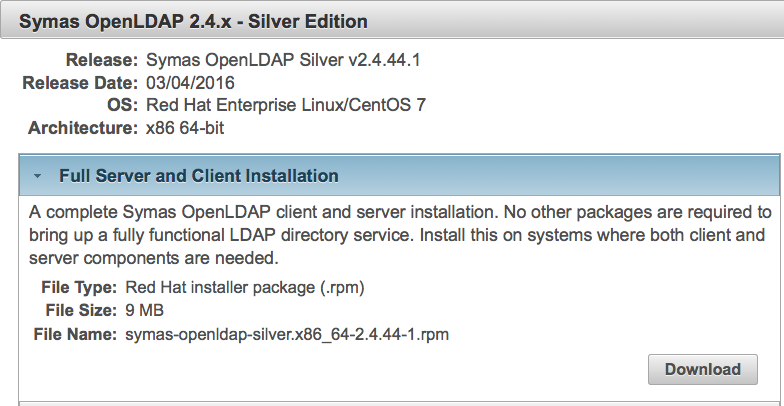

   Licensed to the Apache Software Foundation (ASF) under one
   or more contributor license agreements.  See the NOTICE file
   distributed with this work for additional information
   regarding copyright ownership.  The ASF licenses this file
   to you under the Apache License, Version 2.0 (the
   "License"); you may not use this file except in compliance
   with the License.  You may obtain a copy of the License at

     http://www.apache.org/licenses/LICENSE-2.0

   Unless required by applicable law or agreed to in writing,
   software distributed under the License is distributed on an
   "AS IS" BASIS, WITHOUT WARRANTIES OR CONDITIONS OF ANY
   KIND, either express or implied.  See the License for the
   specific language governing permissions and limitations
   under the License.

# OpenLDAP & Fortress QUICKSTART

 Apache Fortress 1.0-RC42 and OpenLDAP Quickstart System Architecture
 

-------------------------------------------------------------------------------
## Table of Contents

 * Document Overview
 * SECTION 1. Prerequisites
 * SECTION 2. Apache Fortress Core and OpenLDAP Setup
 * SECTION 3. Apache Fortress Core Integration Test
 * SECTION 4. Apache Tomcat Setup
 * SECTION 5. Apache Fortress Rest Setup
 * SECTION 6. Apache Fortress Web Setup

___________________________________________________________________________________
## Document Overview

 * This document contains instructions to download, install and test Apache Fortress Core, Web and Rest components with an OpenLDAP server.
 * All of the instructions to complete these tasks (including OpenLDAP installation) are contained within.
 * Uses Fortress version 1.0-RC42

-------------------------------------------------------------------------------
## SECTION 1. Prerequisites

Minimum hardware requirements:
 * 2 Cores
 * 4GB RAM

Minimum software requirements:
 * Centos or Debian Machine
 * Java SDK 7++
 * Apache Ant 1.7++
 * Apache Maven3++

Everything else covered in steps that follow.  Tested on Debian & Centos systems.
___________________________________________________________________________________
## SECTION 2. Apache Fortress Core and OpenLDAP Setup

1. Download and prepare the package:

 ```
 wget http://www.apache.org/dist/directory/fortress/dist/1.0-RC42/fortress-core-1.0-RC42-source-release.zip
 unzip fortress-core-1.0-RC42-source-release.zip
 cd fortress-core-1.0-RC42
 cp build.properties.example build.properties
 cp slapd.properties.example slapd.properties
 ```

 *[slapd.properties.example](slapd.properties.example) is where the OpenLDAP server defaults reside. This file, after being renamed to slapd.properties, will override values found in build.properties. Learn more about the configuration subsystem: [README-CONFIG](README-CONFIG.md)*

2. Download Symas OpenLDAP Silver *Full Server and Client Installation*:
 https://symas.com/downloads/

 
  *SILVER downloads don't require a registration.*

3. Place either a centos or debian package under the folder named *ldap* : [fortress-core-[VERSION]/ldap](./ldap)

4. Edit the *slapd.properties* file:

 ```
 vi slapd.properties
 ```

5. Update with slapd.properties *slapd.install* statement with reference to openldap pkg downloaded earlier.

 a. For Debian installs:

  ```
  slapd.install=dpkg -i symas-openldap-silver.version.platform.deb
  ```

 b. For Redhat:

  ```
  slapd.install=rpm -i symas-openldap-silver.version.platform.rpm
  ```

6. Specify whether you want to enable the slapo-rbac overlay:

 a. Yes, I want to enable slapo-rbac:

  ```
  rbac.accelerator=true
  ```

 *To use this option, symas-openldap version 2.4.43++ is required.*

 b. No, I don't want to enable slapo-rbac:

  ```
  rbac.accelerator=false
  ```

7. Save and exit

8. Prepare your terminal for execution of maven and ant commands.

 ```
 #!/bin/sh
 export M2_HOME=...
 export JAVA_HOME=...
 export ANT_HOME=...
 export PATH=$PATH:$ANT_HOME/bin:$M2_HOME/bin
 ```

9. Run the maven install:

 ```
 mvn clean install
 ```

 *maven is used to build the software package and prepare its config*

10. Install, configure and load openldap server:

 a. If sudo:

  ```
  sudo ant init-slapd
  ```

 b. No sudo, running as priv user:

  ```
  ant init-slapd
  ```

 *Use ant to install Symas OpenLDAP to target machine.*

___________________________________________________________________________________
## SECTION 3. Apache Fortress Core Integration Test

1. From fortress core base folder, enter the following commands:

 ```
 mvn install -Dload.file=./ldap/setup/refreshLDAPData.xml
 mvn install -Dload.file=./ldap/setup/DelegatedAdminManagerLoad.xml
 ```

 *These will build the Directory Information Tree (DIT), create the config and data policies needed for the integration test to follow.*

2. Next, enter the following command:

 ```
 mvn -Dtest=FortressJUnitTest test
 ```

 *Tests the APIs against your LDAP server.*

3. Verify the tests worked:

 ```
 Tests run: 113, Failures: 0, Errors: 0, Skipped: 0, Time elapsed: 196 sec - in org.apache.directory.fortress.core.impl.FortressJUnitTest

 Results :

 Tests run: 113, Failures: 0, Errors: 0, Skipped: 0

 [INFO]
 [INFO] --- maven-antrun-plugin:1.8:run (default) @ fortress-core ---
 [INFO] Executing tasks

 fortress-load:
 [INFO] Executed tasks
 [INFO] ------------------------------------------------------------------------
 [INFO] BUILD SUCCESS
 [INFO] ------------------------------------------------------------------------
 [INFO] Total time: 03:19 min
 [INFO] Finished at: 2016-01-07T09:28:18-06:00
 [INFO] Final Memory: 27M/532M
 [INFO] ------------------------------------------------------------------------
 ```

4. Rerun the tests to verify teardown APIs work:

 ```
 mvn -Dtest=FortressJUnitTest test
 ```

5. Verify that worked also:

 ```
 Tests run: 141, Failures: 0, Errors: 0, Skipped: 0, Time elapsed: 207.081 sec - in org.apache.directory.fortress.core.impl.FortressJUnitTest

 Results :

 Tests run: 141, Failures: 0, Errors: 0, Skipped: 0

 [INFO]
 [INFO] --- maven-antrun-plugin:1.8:run (default) @ fortress-core ---
 [INFO] Executing tasks

 fortress-load:
 [INFO] Executed tasks
 [INFO] ------------------------------------------------------------------------
 [INFO] BUILD SUCCESS
 [INFO] ------------------------------------------------------------------------
 [INFO] Total time: 03:30 min
 [INFO] Finished at: 2016-01-07T09:33:11-06:00
 [INFO] Final Memory: 27M/531M
 [INFO] ------------------------------------------------------------------------
 ```
 Notice 141 tests ran this time vs 113 the first time.

 Test Notes:
  * If tests complete without errors Apache Fortress works with your OpenLDAP server.
  * These tests load thousands of objects into the target ldap server.
  * Warning messages are negative tests in action.

6. Optional sections in the [README](README.md) file:

 * SECTION 11. Instructions to run the Apache Fortress Command Line Interpreter (CLI).
 * SECTION 12. Instructions to run the Apache Fortress Command Console.
 * SECTION 13. Instructions to build and test the Apache Fortress samples.
 * SECTION 14. Instructions to performance test.

___________________________________________________________________________________
## SECTION 4. Apache Tomcat Setup

During this section, you will be asked to setup Apache Tomcat 8 and prepare for usage with Apache Fortress

1. Download and prepare the package:

 ```
 wget http://www.eu.apache.org/dist/tomcat/tomcat-8/v8.0.30/bin/apache-tomcat-8.0.30.tar.gz
 tar -xvf apache-tomcat-8.0.30.tar.gz
 sudo mv apache-tomcat-8.0.30 /usr/local/tomcat8
 ```
 *Change the tomcat version as neeeded - v7 and beyond are ok.*

2. Download the fortress realm proxy jar into tomcat/lib folder:

  ```
  sudo wget http://repo.maven.apache.org/maven2/org/apache/directory/fortress/fortress-realm-proxy/1.0-RC42/fortress-realm-proxy-1.0-RC42.jar -P /usr/local/tomcat8/lib
  ```

3. Prepare tomcat fortress usage:

 ```
 sudo vi /usr/local/tomcat8/conf/tomcat-users.xml
 ```

4. Add tomcat user to deploy fortress:

 ```
 <role rolename="manager-script"/>
 <role rolename="manager-gui"/>
 <user username="tcmanager" password="m@nager123" roles="manager-script"/>
 <user username="tcmanagergui" password="m@nager123" roles="manager-gui"/>
 ```

5. Save and exit tomcat-users.xml file

6. Configure Tomcat as a service (optional)

 a. Edit the config file:

 ```
 vi /etc/init.d/tomcat
 ```

 b. Add the following:

 ```
 #!/bin/bash
 # description: Tomcat Start Stop Restart
 # processname: tomcat
 # chkconfig: 234 20 80
 CATALINA_HOME=/usr/local/tomcat8
 case $1 in
 start)
 sh $CATALINA_HOME/bin/startup.sh
 ;;
 stop)
 sh $CATALINA_HOME/bin/shutdown.sh
 ;;
 restart)
 sh $CATALINA_HOME/bin/shutdown.sh
 sh $CATALINA_HOME/bin/startup.sh
 ;;
 esac
 exit 0
 ```

 c. Add the init script to startup for run level 2, 3 and 4:

 ```
 cd /etc/init.d
 chmod 755 tomcat
 chkconfig --add tomcat
 chkconfig --level 234 tomcat on
 ```

7. Start tomcat server:

 a. If running Tomcat as a service:

 ```
 service tomcat start
 ```

 b. Else

 ```
 sudo /usr/local/tomcat8/bin/startup.sh
 ```

8.  Verify clean logs after startup:

 ```
 tail -f -n10000 /usr/local/tomcat8/logs/catalina.out
 ```

9.  Verify setup by signing onto the Tomcat Manager app with credentials userId: tcmanagergui, password: m@nager123

 ```
 http://hostname:8080/manager
 ```

___________________________________________________________________________________
## SECTION 5. Apache Fortress Rest Setup

During this section, you will be asked to setup Apache Fortress Rest Application

1. Download and prepare the package:

 ```
 wget http://www.apache.org/dist/directory/fortress/dist/1.0-RC42/fortress-rest-1.0-RC42-source-release.zip
 unzip fortress-rest-1.0-RC42-source-release.zip
 cp ./fortress-core-1.0-RC42/config/fortress.properties ./fortress-rest-1.0-RC42/src/main/resources
 cd fortress-rest-1.0-RC42
 ```

2. Build, perform fortress rest test policy load and deploy to Tomcat:

 ```
 mvn clean install -Dload.file=./src/main/resources/FortressRestServerPolicy.xml tomcat:deploy
 ```

3. Redeploy (if need be):

 ```
 mvn tomcat:redeploy
 ```

4. Smoke test:

 ```
 mvn test -Dtest=EmTest
 ```

___________________________________________________________________________________
## SECTION 6. Apache Fortress Web Setup

During this section, you will be asked to setup Apache Fortress Web Application

1. Download and prepare the package:

 ```
 wget http://www.apache.org/dist/directory/fortress/dist/1.0-RC42/fortress-web-1.0-RC42-source-release.zip
 unzip fortress-web-1.0-RC42-source-release.zip
 cp ./fortress-core-1.0-RC42/config/fortress.properties ./fortress-web-1.0-RC42/src/main/resources
 cd fortress-web-1.0-RC42
 ```

2. Build, perform fortress web test policy load and deploy to Tomcat:

 ```
 mvn clean install -Dload.file=./src/main/resources/FortressWebDemoUsers.xml tomcat:deploy
 ```

3. Redeploy (if need be):

 ```
 mvn tomcat:redeploy
 ```

4. Open browser and test (creds: test/password):

 ```
 http://hostname:8080/fortress-web
 ```

5. Click on the links, to pull up various views on the data stored in the directory.

6. Run the selenium automated test:

 ```
 mvn test -Dtest=FortressWebSeleniumITCase
 ```

 *Requires Firefox on target machine.*

 ___________________________________________________________________________________
  #### END OF README-QUICKSTART-SLAPD