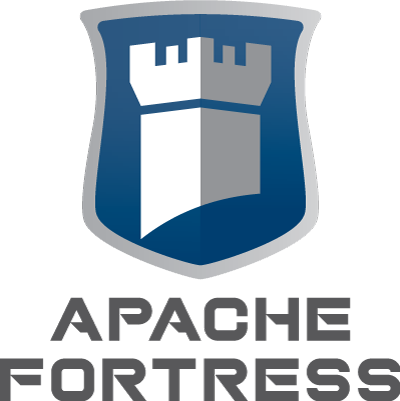
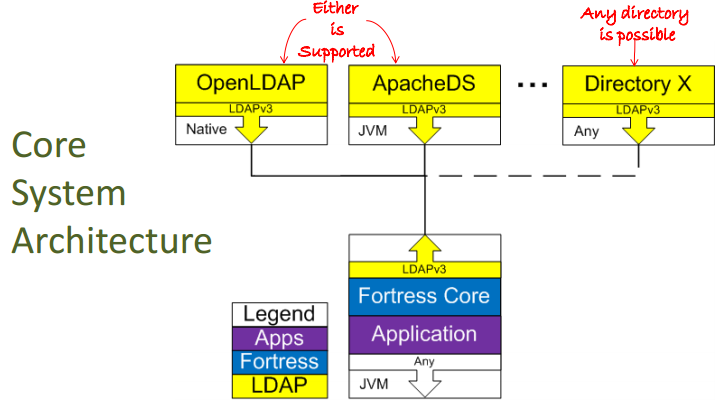

Role-Based Access Control (RBAC)
-------------------------------------------------------------------------------
# LICENSE

   Licensed to the Apache Software Foundation (ASF) under one
   or more contributor license agreements.  See the NOTICE file
   distributed with this work for additional information
   regarding copyright ownership.  The ASF licenses this file
   to you under the Apache License, Version 2.0 (the
   "License"); you may not use this file except in compliance
   with the License.  You may obtain a copy of the License at

     https://www.apache.org/licenses/LICENSE-2.0

   Unless required by applicable law or agreed to in writing,
   software distributed under the License is distributed on an
   "AS IS" BASIS, WITHOUT WARRANTIES OR CONDITIONS OF ANY
   KIND, either express or implied.  See the License for the
   specific language governing permissions and limitations
   under the License.

-------------------------------------------------------------------------------
# Overview

 * FORTRESS, a sub-project of the Apache Directory, is a standards-based access management system, written in Java, that provides
  role-based access control, delegated administration and password policy services using an LDAP backend.
 * This repo is contains the Apache Fortress Core component.
 
 * There are three other git repos that comprise the project:
   - [Realm for Apache Tomcat](https://github.com/apache/directory-fortress-realm)
   - [Rest/JSON APIs](https://github.com/apache/directory-fortress-enmasse)
   - [Web Admin Pages](https://github.com/apache/directory-fortress-commander)
 * For more information, visit https://directory.apache.org/fortress/

-------------------------------------------------------------------------------
## Table of Contents

 * Document Overview
 * Tips for first-time users.
 * SECTION 1.  Prerequisites
 * SECTION 2.  Download & Install.
 * SECTION 3.  Options for using Apache Fortress and LDAP.
 * SECTION 4.  Instructions for using Apache Fortress and ApacheDS LDAP server.
 * SECTION 5.  Instructions for using Apache Fortress and Symas OpenLDAP server.
 * SECTION 6.  Instructions for using Apache Fortress and native OpenLDAP server.
 * SECTION 7.  Instructions for configuring OpenLDAP.
 * SECTION 8.  Instructions for using Apache Fortress with OpenLDAP.
 * SECTION 9.  Instructions to integration test.
 * SECTION 10. Instructions to load policy data using Apache Fortress Load utility.
 * SECTION 11. Instructions to run the Apache Fortress Command Line Interpreter (CLI).
 * SECTION 12. Instructions to run the Apache Fortress Command Console.
 * SECTION 13. Instructions to build and test the Apache Fortress samples.
 * SECTION 14. Howto Debug a load script.
___________________________________________________________________________________
## Document Overview

This document contains instructions to download, install, test, and manage an LDAP server using the Apache Fortress Core.
___________________________________________________________________________________
##  Tips for first-time users

 * If you see **FORTRESS_HOME**, refer to the package [root folder](.).
 * If you see **OPENLDAP_HOME**, refer to the root of OpenLDAP binary installation folder, e.g. /opt/etc/openldap
 * This package uses Apache Maven to build and the [pom.xml](./pom.xml) is in the root folder.
 * The configuration subsystem manages coordinates to the targeted ldap server and more.  Here's how it works [README-CONFIG](./README-CONFIG.md).
 * This system runs within a multitenant context.  To learn how [README-MULTITENANCY](./README-MULTITENANCY.md).
 * Questions about usage may be directed to the mailing list:
   * https://mail-archives.apache.org/mod_mbox/directory-fortress/

-------------------------------------------------------------------------------
## SECTION 1. Prerequisites

Minimum software requirements:
 * git
 * Java SDK >= 8
 * Apache Maven >= 3

___________________________________________________________________________________
## SECTION 2. Download & Install

From Apache GIT Fortress-Core Software Repo:
 https://gitbox.apache.org/repos/asf?p=directory-fortress-core.git

1. Clone the SNAPSHOT:
```
git clone  https://gitbox.apache.org/repos/asf/directory-fortress-core.git
```

 * or by specific version, e.g. 2.0.8

```
git clone --branch 2.0.8  https://gitbox.apache.org/repos/asf/directory-fortress-core.git
```

2. Set Java and Maven home on machines.

3. From the FORTRESS_HOME root folder, enter the following command:

a. Java 8 target

```
mvn clean install
```

-- OR --

b. Java 11 target

```
mvn clean install -Djava.version=11
```

4. From the FORTRESS_HOME root folder, enter the following command:

```
mvn javadoc:javadoc
```

5. View the generated document here: [./target/site/apidocs/overview-summary.html](./target/site/apidocs/overview-summary.html).

Install Notes:
 * The Apache Fortress [pom.xml](./pom.xml) may run without connection to Internet iff its dependencies are already present in local or intermediate maven repo.
 * Running ```mvn install``` calls out to maven-ant **init-fortress-config** task in [build.xml](./build.xml) to regenerate configuration artifacts (more info here: [README-CONFIG](./README-CONFIG.md)).

___________________________________________________________________________________
## SECTION 3.  Options for using Apache Fortress and LDAP server

This document describes three options to use Apache Fortress with:

1. ApacheDS LDAP server
 * **SECTION 4**. Apache Fortress and ApacheDS LDAP server
2. Symas OpenLDAP server
 * **SECTION 5**. Apache Fortress and Symas OpenLDAP server
3. Pre-existing OpenLDAP server
 * **SECTION 6**. Apache Fortress and native OpenLDAP server

*Options 1 & 2 are recommended for first-time users.  Option 3 is for advanced users.*
___________________________________________________________________________________
## SECTION 4. Instructions for using Apache Fortress and ApacheDS LDAP server

 * Follow these instructions: [README-QUICKSTART-APACHEDS](./README-QUICKSTART-APACHEDS.md)

___________________________________________________________________________________
## SECTION 5. Instructions for using Apache Fortress and Symas OpenLDAP server

 * Follow these instructions: [README-QUICKSTART-SLAPD](./README-QUICKSTART-SLAPD.md)

___________________________________________________________________________________
## SECTION 6. Instructions for using Apache Fortress and native OpenLDAP server

 Do these sections:

 * SECTION 2.  Download & Install
 * SECTION 7.  Instructions for configuring OpenLDAP
 * SECTION 8.  Instructions for using Apache Fortress with OpenLDAP
 * SECTION 9.  Instructions to integration test

___________________________________________________________________________________
## SECTION 7. Instructions for configuring OpenLDAP

1. Install OpenLDAP using preferred method.

 For example:

 A. On Debian systems: http://wiki.debian.org/LDAP/OpenLDAPSetup

 B. Ubuntu: https://help.ubuntu.com/community/OpenLDAPServer

 C. etc.

2. Copy fortress schema to openldap schema folder:

```
cp FORTRESS_HOME/ldap/schema/fortress.schema OPENLDAP_HOME/etc/openldap/schema
```

3. Edit slapd.conf:

```
vi OPENLDAP_HOME/etc/openldap/slapd.conf
```

4. Enable Fortress schema.

 Add to the top of the file:
```
include OPENLDAP_HOME/etc/openldap/schema/fortress.schema
```

5. For password policy support, enable pwpolicy overlay.

 Add right before the ACL definitions:

```
moduleload	 ppolicy.la
```

6. For Fortress audit support, enable slapo accesslog overlay.

```
moduleload  accesslog.la
```

7. Enable Fortress default DB.

```
# Default DB Settings
database	mdb
maxreaders 64
maxsize 1000000000
suffix  "dc=example,dc=com"
rootdn  "cn=Manager,dc=example,dc=com"
rootpw  "{SSHA}pSOV2TpCxj2NMACijkcMko4fGrFopctU"

index uidNumber,gidNumber,objectclass eq
index cn,sn,ftObjNm,ftOpNm,ftRoleName,uid,ou eq,sub
index ftId,ftPermName,ftRoles,ftUsers,ftRA,ftARA eq

directory  "/var/openldap/dflt"
overlay    accesslog
logdb      "cn=log"
dbnosync
checkpoint	64 5
```

8. Enable Fortress slapo access log DB.

```
# History DB Settings  (optional)
database	 mdb
maxreaders  64
maxsize     1000000000
suffix      "cn=log"
rootdn      "cn=Manager,cn=log"
rootpw      "{SSHA}pSOV2TpCxj2NMACijkcMko4fGrFopctU"
index objectClass,reqDN,reqAuthzID,reqStart,reqAttr eq
directory	 "/var/openldap/hist"
access to *
by dn.base="cn=Manager,cn=log" write
dbnosync
checkpoint   64 5
```

9. Set the slapo access log usage policy on DB.

```
# Audit Log Settings (optional)
# note: the following settings may be tailored to your requirements:
logops bind writes compare
logoldattr ftModifier ftModCode ftModId ftRC ftRA ftARC ftARA ftCstr ftId ftPermName ftObjNm ftOpNm ftObjId ftGroups ftRoles ftUsers ftType
logpurge 5+00:00 1+00:00
```

10. Enable slapo pwpolicy overlay.

```
#######################################################################
# PW Policy Settings
#######################################################################
# Enable the Password Policy overlay to enforce password policies on this database.
overlay     ppolicy
ppolicy_default "cn=PasswordPolicy,ou=Policies,dc=example,dc=com"
ppolicy_use_lockout
ppolicy_hash_cleartext
```

11. Add to OpenLDAP ACL's.

```
### ACLs
access to dn="" by * read
access to *
by self write
by users read
by anonymous auth
by sockurl="^ldapi:///$" write

### This one allows user to modify their own password (needed for pw policies):
### This also allows user to modify their own ftmod attributes (needed for audit):
access to attrs=userpassword
      by self write
      by * auth
```

12. A few more for good measure.

```
# Never allow anonymous binds:
disallow bind_anon

# Speeds up member list processing for ldap group operations:
sortvals  roleOccupant

# Convenience:
gentlehup on

# Sensible defaults:
sizelimit 5000
timelimit 60
threads 8
loglevel 32768

```

13. Create the dirs needed by the new slapd databases:

```
mkdir /var/openldap/dflt
mkdir /var/openldap/hist
```

14. Restart the slapd daemon.  Ensure there are no errors.

Config Notes:
 * Have a look at sample slapd.conf file: [./ldap/slapd.conf.src](./ldap/slapd.conf.src).


___________________________________________________________________________________
## SECTION 8. Instructions for using Apache Fortress with OpenLDAP

1. Copy FORTRESS_HOME/build.properties.example to build.properties and FORTRESS_HOME/slapd.properties.example to slapd.properties:

```
cp build.properties.example build.properties
cp slapd.properties.example slapd.properties
```

2. Edit the **slapd.properties** file.

```
vi slapd.properties
```

3. Tell the runtime using OpenLDAP:

```
ldap.server.type=openldap
```

4. Set the LDAP Host and port properties.  Either a valid host name or IP address can be used.  If you are running on the same platform as your LDAP server, localhost will do.

```
host=localhost
port=389
```

5. Set the suffix name and domain component.  These may be set according to your requirements.  For example **suffix.name=example** and **suffix.dc=com** turns into **dc=example,dc=com**.

```
suffix.name=example
suffix.dc=com
```

 * Optional - if a multi-level suffix needed, e.g. dc=foo, dc=example, dc=com.

```
suffix.name=foo
suffix.dc=example
suffix.dc2=com
suffix=dc=${suffix.name},dc=${suffix.dc},dc=${suffix.dc2}
```

6. Add to the file to enable LDAP connection pool parameters.

```
# Here we are testing with slapd's root user.  Never do this in prod envs.
# This value contains dn of service account that has read/write access to fortress LDAP DIT:
root.dn=cn=Manager,${suffix}

# This the admin password:
cfg.root.pw=secret

# Specify the min/max settings for ADMIN conn pool w/ both read & write connections to default DB:
admin.min.conn=1

# The optimal setting for max is much fewer than concurrent number of users on system.
admin.max.conn=10

# Specify the min/max settings for USER conn pool with permission to bind to user objects as self:
user.min.conn=1

# The optimal setting for max will be much fewer than concurrent number of users.
user.max.conn=10
```

7. Enable the fortress audit and its connection pool.

 *This step is optional.*

```
# If you don't have slapo-access log overlay enabled, disable the Fortress audit with this param.
# 'true' turns it off.  The default is 'false'.
disable.audit=false

# This value contains dn of user that has read access to slapd access log database:
log.root.dn=cn=Manager,${log.suffix}

# This password is for same log user:
cfg.log.root.pw=secret

# The min/max settings for LOG pool w/ read permissions to slapo access log:
log.min.conn=1

# Very few needed because only used by AuditMgr during search operations:
log.max.conn=3

# Set more audit logger parameters (openldap only):
log.suffix=cn=log

# To enable slapd persistence on the following OpenLDAP operations:
log.ops=logops search bind writes
```

8. Rebuild the configuration artifacts:

```
mvn clean install
```

9. Perform an initial load to the target LDAP server:

```
mvn install -Dload.file=./ldap/setup/refreshLDAPData.xml
```

  * Do not run this target with **refreshLDAPData.xml** on production systems as it deletes all nodes beneath the suffix before readding.

More usage notes of fortress build property files:
 * The defaults usually work.
 * The [build.properties.example]([build.properties.example) contains defaults for ApacheDS.  This file is required and will activate once renamed to **build.properties**.
 * The [slapd.properties.example](slapd.properties.example) is optional.  Use *only* when OpenLDAP is the target server.  Once renamed to **slapd.properties**, it will override any values found in the **build.properties** file.
 * Learn more about the configuration subsystem: [README-CONFIG](./README-CONFIG.md)
 * Learn more about what properties there are: [README-PROPERTIES](README-PROPERTIES.md).
 * Don't change the ant substitution parameters within the properties *unless you know what you're doing*.  These are are the settings inside of curly brackets, e.g. **${param1}**.

___________________________________________________________________________________
## SECTION 9. Instructions to integration test

1. From **FORTRESS_HOME** enter the following commands:

```
mvn install -Dload.file=./ldap/setup/refreshLDAPData.xml
mvn install -Dload.file=./ldap/setup/DelegatedAdminManagerLoad.xml
```

 These will build the Directory Information Tree, load the configuration node and security policy needed for integration testing.
 Never run in production environment as **refreshLDAPData.xml** tears down all nodes under the target suffix.

2. Next, from **FORTRESS_HOME** enter the following command:

```
mvn -Dtest=FortressJUnitTest test
```

 Tests that all of the APIs and security functions work on your LDAP server.

3. Verify the tests worked:

```
Tests run: Failures: 0, Errors: 0, Skipped: 0, Time elapsed: 196 sec - in org.apache.directory.fortress.core.impl.FortressJUnitTest

Results :

Tests run: Failures: 0, Errors: 0, Skipped: 0

[INFO]
[INFO] --- maven-antrun-plugin:1.8:run (default) @ fortress-core ---
[INFO] Executing tasks

fortress-load:
[INFO] Executed tasks
[INFO] ------------------------------------------------------------------------
[INFO] BUILD SUCCESS
[INFO] ------------------------------------------------------------------------
[INFO] Total time: 03:19 min
[INFO] Finished at: 2016-01-07T09:28:18-06:00
[INFO] Final Memory: 27M/532M
[INFO] ------------------------------------------------------------------------
```

4. Rerun the tests to verify teardown APIs work:

```
mvn -Dtest=FortressJUnitTest test
```

5. Verify that worked also:

```
Tests run: Failures: 0, Errors: 0, Skipped: 0, Time elapsed: 207.081 sec - in org.apache.directory.fortress.core.impl.FortressJUnitTest

Results :

Tests run: Failures: 0, Errors: 0, Skipped: 0

[INFO]
[INFO] --- maven-antrun-plugin:1.8:run (default) @ fortress-core ---
[INFO] Executing tasks

fortress-load:
[INFO] Executed tasks
[INFO] ------------------------------------------------------------------------
[INFO] BUILD SUCCESS
[INFO] ------------------------------------------------------------------------
[INFO] Total time: 03:30 min
[INFO] Finished at: 2016-01-07T09:33:11-06:00
[INFO] Final Memory: 27M/531M
[INFO] ------------------------------------------------------------------------
```
 Notice that more tests ran this time vs the first time, due to teardown.

6. You can now clear out the test data and policies by rerunning this command:

```
mvn install -Dload.file=./ldap/setup/refreshLDAPData.xml
```

 Test Notes:
  * If tests complete without errors Apache Fortress works with your LDAP server.
  * These tests load thousands of objects into the target ldap server.  You should clear out the test data in the end.
  * Warning messages are negative tests in action.

___________________________________________________________________________________
## SECTION 10. Instructions to load policy data using Apache Fortress Load utility

 The Load utility is useful to create base policy configurations that need to be rerun many times in different test and production environments.
 For samples look here: [./ldap/setup](./ldap/setup).

1. Create a load file using examples from **FORTRESS_HOME**/ldap/setup folder.

 e.g. myLoadFile.xml

2. From **FORTRESS_HOME** folder, enter the following command:

 ```
 mvn install -Dload.file=./ldap/setup/myLoadFile.xml
 ```

Policy Load Notes:
 * This maven target executes **FortressAntTask** to automate data loads into the LDAP server using the Fortress APIs.
 * More info on ant load utility in the generated javadoc:
  * [./target/site/apidocs/org/apache/directory/fortress/core/ant/FortressAntTask.html](./target/site/apidocs/org/apache/directory/fortress/core/ant/FortressAntTask.html)

___________________________________________________________________________________
## SECTION 11. Instructions to run the Apache Fortress Command Line Interpreter (CLI)

 The CLI is useful for ad-hoc policy administration in runtime environments.

1. From **FORTRESS_HOME** enter the following command:

```
mvn -Pcli test
```

2. Which starts the Fortress command line interpreter:

```
CommandLineInterpreter:176 - Startup to interactive mode success...
CommandLineInterpreter:183 - CLI function groups include admin, review, system, dadmin, group
CommandLineInterpreter:185 - Enter one from above or 'q' to quit
```

3. Where subsequent commands can be performed.  For example to add a new user:

```
admin auser -u testuser1 -p mypasword123 -o dev1
2016-01-07 09:17:030 INFO  CommandLineInterpreter:1078 - arg:admin
2016-01-07 09:17:030 INFO  CommandLineInterpreter:1078 - arg:auser
2016-01-07 09:17:030 INFO  CommandLineInterpreter:1078 - arg:-u
2016-01-07 09:17:030 INFO  CommandLineInterpreter:1078 - arg:testuser1
2016-01-07 09:17:030 INFO  CommandLineInterpreter:1078 - arg:-p
2016-01-07 09:17:030 INFO  CommandLineInterpreter:1078 - arg:-o
2016-01-07 09:17:030 INFO  CommandLineInterpreter:1078 - arg:dev1
2016-01-07 09:17:030 INFO  CommandLineInterpreter:487 - auser
2016-01-07 09:17:030 INFO  CommandLineInterpreter:683 - command:auser was successful
2016-01-07 09:17:030 INFO  CommandLineInterpreter:183 - CLI function groups include admin, review, system, dadmin, group
2016-01-07 09:17:030 INFO  CommandLineInterpreter:185 - Enter one from above or 'q' to quit
```

4. Or to interrogate users:

```
review fuser -u testuser1
2016-01-07 09:18:042 INFO  CommandLineInterpreter:1078 - arg:review
2016-01-07 09:18:042 INFO  CommandLineInterpreter:1078 - arg:fuser
2016-01-07 09:18:042 INFO  CommandLineInterpreter:1078 - arg:-u
2016-01-07 09:18:042 INFO  CommandLineInterpreter:1078 - arg:testuser1
2016-01-07 09:18:042 INFO  CommandLineInterpreter:713 - fuser
2016-01-07 09:18:042 INFO  CommandLineInterpreter:1443 - U   CTR  [0]
2016-01-07 09:18:042 INFO  CommandLineInterpreter:1443 - U   UID  [testuser1]
2016-01-07 09:18:042 INFO  CommandLineInterpreter:1443 - U   IID  [20ef2dfd-0b86-41a5-87d6-f7081e455d76]
2016-01-07 09:18:042 INFO  CommandLineInterpreter:1443 - U   CN   [testuser1]
2016-01-07 09:18:042 INFO  CommandLineInterpreter:1443 - U   DESC [null]
2016-01-07 09:18:042 INFO  CommandLineInterpreter:1443 - U   OU   [dev1]
2016-01-07 09:18:042 INFO  CommandLineInterpreter:1443 - U   SN   [testuser1]
```

5. Or perform any of the other APIs as a shell program, follow instructions in the command line interpreter reference manual, contained within the generated javadoc:
 * [./target/site/apidocs/org/apache/directory/fortress/core/cli/package-summary.html/package-summary.html](./target/site/apidocs/org/apache/directory/fortress/core/cli/package-summary.html)

___________________________________________________________________________________
## SECTION 12. Instructions to run the Apache Fortress Command Console

 The Command Console is an interactive program that is allows ad-hoc edit and reporting on data stored in LDAP server.

1. From **FORTRESS_HOME** enter the following command:

```
mvn -Pconsole test
```

2. Is a menu-driven program.  Select option:

```
CHOOSE FUNCTION:
1. RBAC ADMIN MANAGER
2. RBAC REVIEW MANAGER
3. RBAC ACCESS MANAGER
4. ARBAC ADMIN MANAGER
5. ARBAC REVIEW MANAGER
6. ARBAC ACCESS MANAGER
7. PASSWORD POLICY MANAGER
8. AUDIT MANAGER
9. CONFIG MANAGER
A. ENCRYPTION MANAGER
B. GROUP MANAGER
C. RBAC ACCELERATOR MANAGER
Enter q or Q to quit
```

3. Option 1 performs Administrative operations:

```
CHOOSE ADMIN MANAGER FUNCTION:
1.  Add User
2.  Update User
3.  Delete User
4.  Unlock User
5.  Lock User Account
6.  Reset User Password
7.  Change User Password
8.  Add Perm Object
9.  Add Perm Operation
0.  Delete  Perm
A.  Add Role
B.  Update Role
C.  Delete Role
D.  Assign User to Role
E.  Deassign User from Role
F.  Grant Perm to Role
G.  Revoke Perm from Role
H.  Grant Perm to User
I.  Revoke Perm from User
J.  Add Role Inheritance
K.  Remove Role Inheritance
L.  Add Role Ascendant
M.  Add Role Descendant
N.  Add SSD Data Set
O.  Add DSD Data Set
Enter q or Q to return to previous menu
```

4. Option 2 performs Review operations:

```
CHOOSE REVIEW MANAGER FUNCTION:
0. Search Users
1. Search Users by OU
2. Get User by IID
3. Read User
4. Search Permissions
5. Read Permissions
6. Read Role
7. Search Roles
8. Perm Roles
9. Perm Users
A. Authorized Users
B. Role Permissions
C. Get Assigned Roles
Enter q or Q to return to previous menu
```

5. Option 3 performs Access operations (for testing):

```
CHOOSE ACCESS MANAGER FUNCTION:
1. Authenticate
2. Create Session
3. Create Session Trusted
4. Create Session with Roles Trusted
5. Create Session with Props
6. Check Access - RBAC
7. Session Roles
8. Add Active Role to Session
9. Drop Active Role from Session
0. Show User Data in Session
A. Show UserId in Session
B. Session Permissions
Enter q or Q to return to previous menu
```

6. etc... for PW Policy, ARBAC, Groups.

___________________________________________________________________________________
## SECTION 13. Instructions to build and test the Apache Fortress samples

1. From **FORTRESS_HOME** enter the following command:

```
mvn -Dtest=AllSamplesJUnitTest test
```

2. View and change the samples here:
 [./src/test/java/org/apache/directory/fortress/core/samples](./src/test/java/org/apache/directory/fortress/core/samples)

3. Compile and re-run samples to test your changes using:

```
mvn -Dtest=AllSamplesJUnitTest test
```

4. Sample show how to use the APIs
 e.g. How to Grant a Permission to a Role:

```java
AdminMgr adminMgr = AdminMgrFactory.createInstance(TestUtils.getContext());

Role inRole = new Role(CreateRoleSample.TEST_ROLE_PREFIX + i);

// Permissions contain Object to Operation mapping and once created can then be targeted for assignment to Role entities in ldap:
Permission inPerm = new Permission(TEST_PERM_OBJECT, TEST_PERM_OPERATION_PREFIX + j);

// This API grant a Permission to a Role:
adminMgr.grantPermission(inPerm, inRole);
```

Sample Notes:
 * Test cases are simple and useful for learning how to code using Apache Fortress APIs.
 * Tests should complete without ERRORS.
 * These tests will load some records into the target ldap server.
 * The target may be run as many times as necessary and should be run at least twice to test the teardown.
 * The 2nd and subsequent times runs, it will tear down the data loaded during the prior run.

___________________________________________________________________________________
## SECTION 14. Howto Debug a load script

1. Add -Ddebug=port to runtime args:

```
mvn install -Dload.file=./ldap/setup/refreshLDAPData.xml -Ddebug=5432
```

 Which suspends the process waiting for connection on port specified, e.g. 5432.
 
```
fortress-load-debug:
     [echo] ############### Run Fortress Ant script to load policy ###############
 [startAnt] Listening for transport dt_socket at address: 5432
```

2. Set breakpoints in [FortressAntTask](src/main/java/org/apache/directory/fortress/core/ant/FortressAntTask.java)

3. Connect with the JDB on the specified port.

#### END OF README
